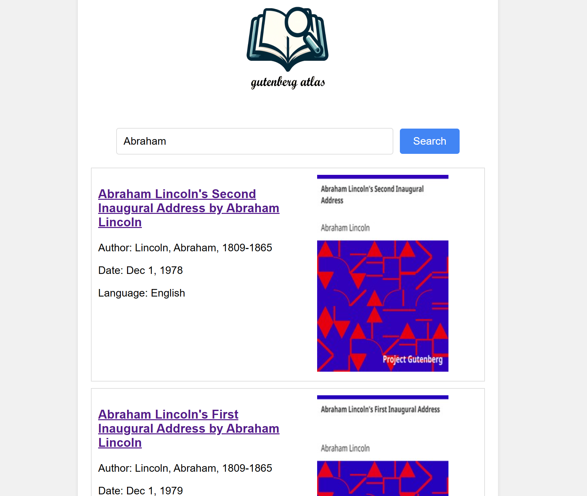

# Milestone 6: Cloud Deployment

## Usage

### Build the Search Engine

1. Start the nodes by running the following command in your terminal: `./local_nodes.sh 5`. You can replace `5` with the number of nodes you want to start.

2. Use consistent hashing or rendezvous hashing to load URL using sharding by running: `node ./urls/loadUrls.js --url 100`, replace `100` with the number of urls you want to scrape.

3. Scrape HTML contents by running: `node ./engine/scraper.js`, if you want to scrape metadata (author, cover, language, title of the books), use the flag `node ./engine/scraper.js --meta`

4. Do inverted index and calculate term frequency-inverse document frequency (TF-IDF) by running: `node ./engine/indexer.js`, use the flag `node ./engine/indexer.js --bigram` if you want to calculate ngram with TFIDF.

### Query

1. To search books, run the following command with your query: `node ./engine/query.js --query "gutenberg project"`, replace `"gutenberg project"` with your search query. The search results are sorted in descending order based on TF-IDF. 

2. If you want to use the search engine on a browser:

- Start a HTTP backend server by running:

  ```bash
  node ./web/server.js
  ```

  The server runs on port 9999

- Open `./web/index.html` in your browser to search the books. Or you can use `npm install -g http-server` and run `cd ./web && http-server`, open [http://127.0.0.1:8080](http://127.0.0.1:8080) with your browser to run the web.

## Examples




